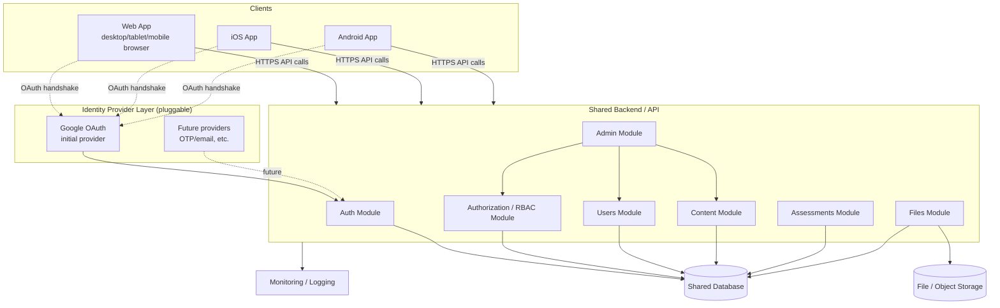
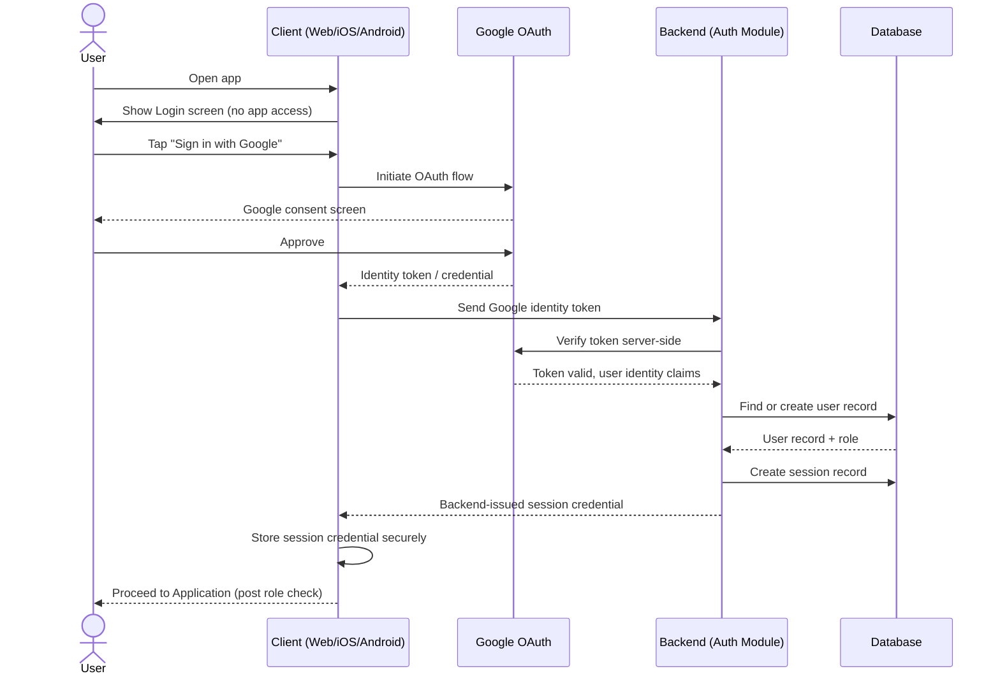
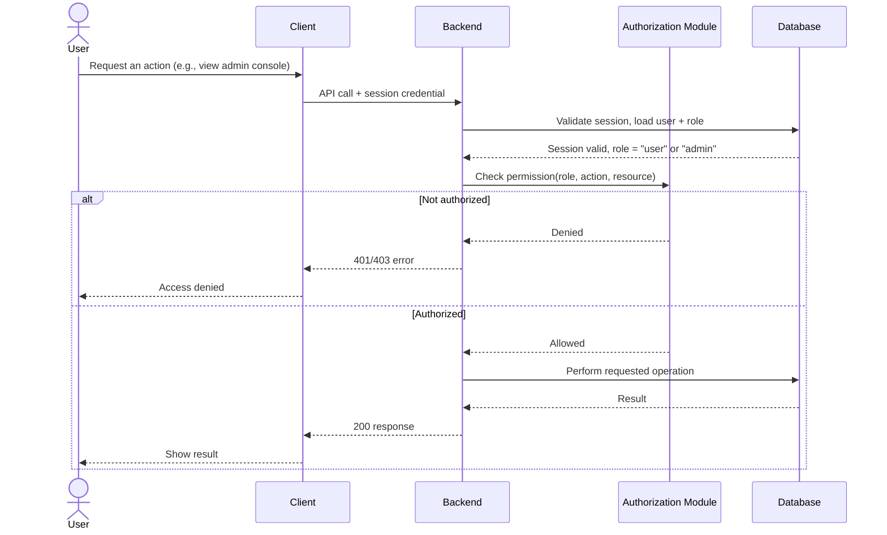
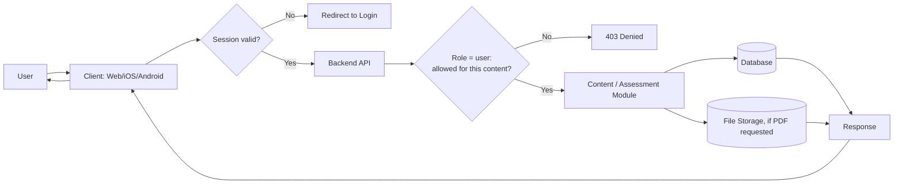
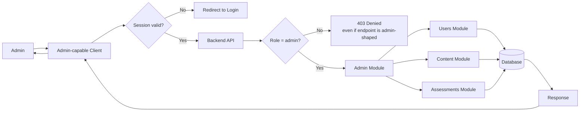
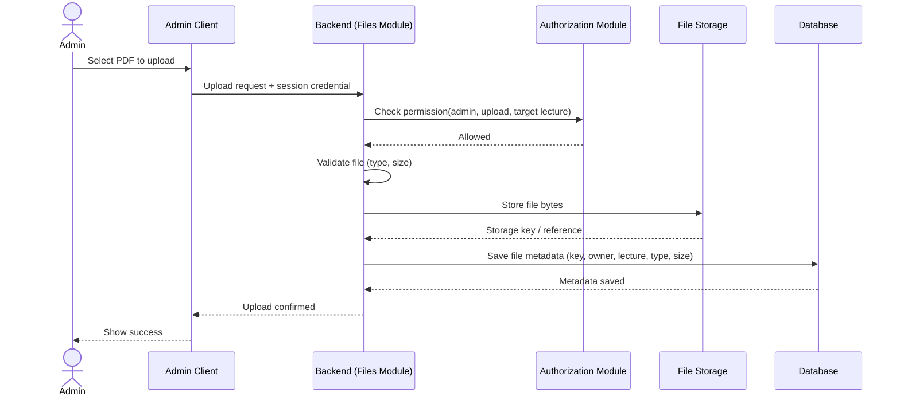
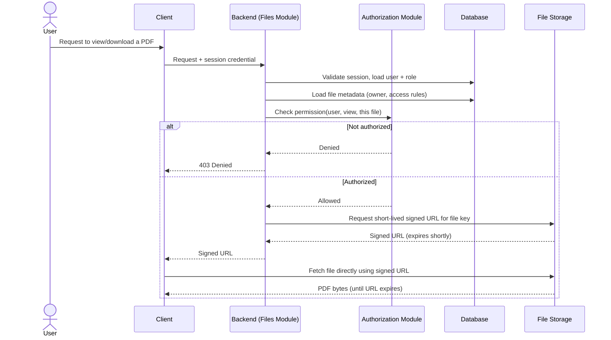
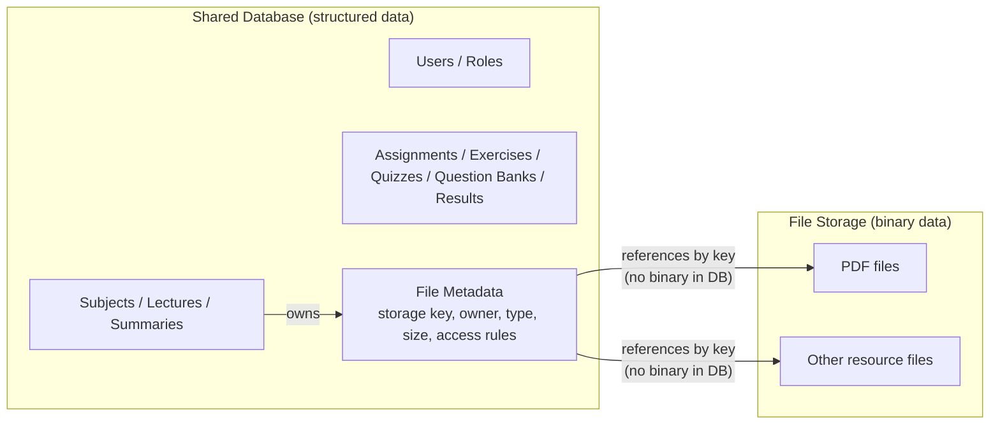

# Architecture Diagrams

Status: Phase 2 (Architecture) — diagrams only, no implementation. Companion to `ARCHITECTURE.md`.

## 1. High-Level Architecture



## 2. Authentication Flow



## 3. Authorization Flow



## 4. User Request Flow



## 5. Admin Request Flow



## 6. File Upload Flow



## 7. Secure PDF Access Flow



## 8. Web / Mobile / Backend Relationship

```mermaid
flowchart TB
    subgraph "Clients (presentation only)"
        WEB[Web<br/>desktop/tablet/mobile browser]
        IOS[iOS App]
        AND[Android App]
    end
    API[["Shared Backend API<br/>(single contract, versioned)"]]
    WEB --> API
    IOS --> API
    AND --> API
    API --> BIZ[Business Logic +<br/>Authorization<br/>(lives only here)]
    BIZ --> DB[(Shared Database)]
    BIZ --> STORE[(Shared File Storage)]
```

## 9. Database / Storage Relationship


