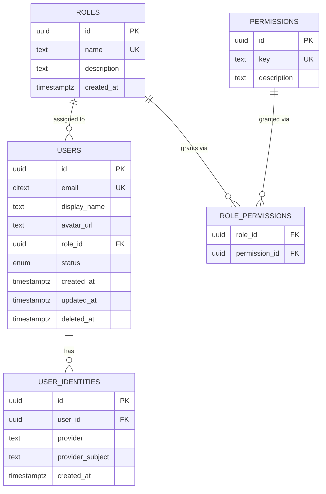
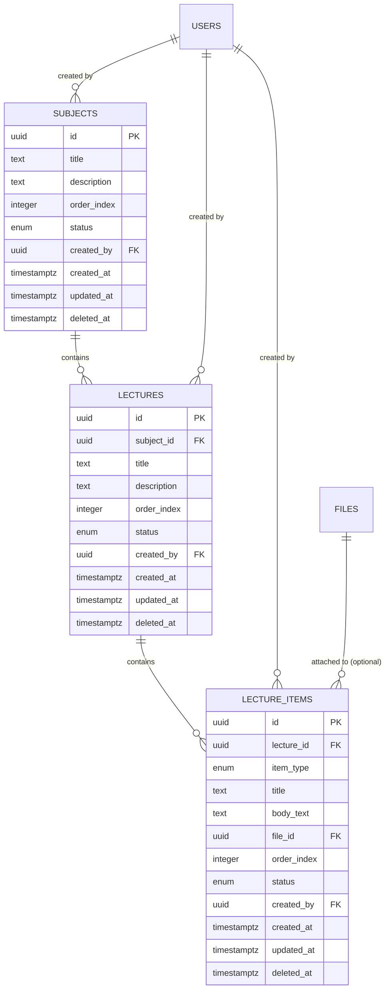
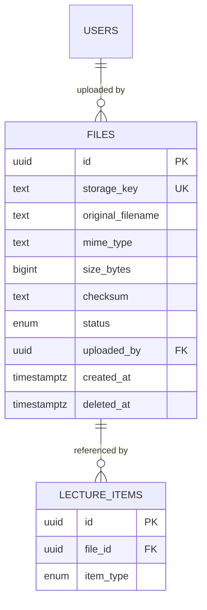
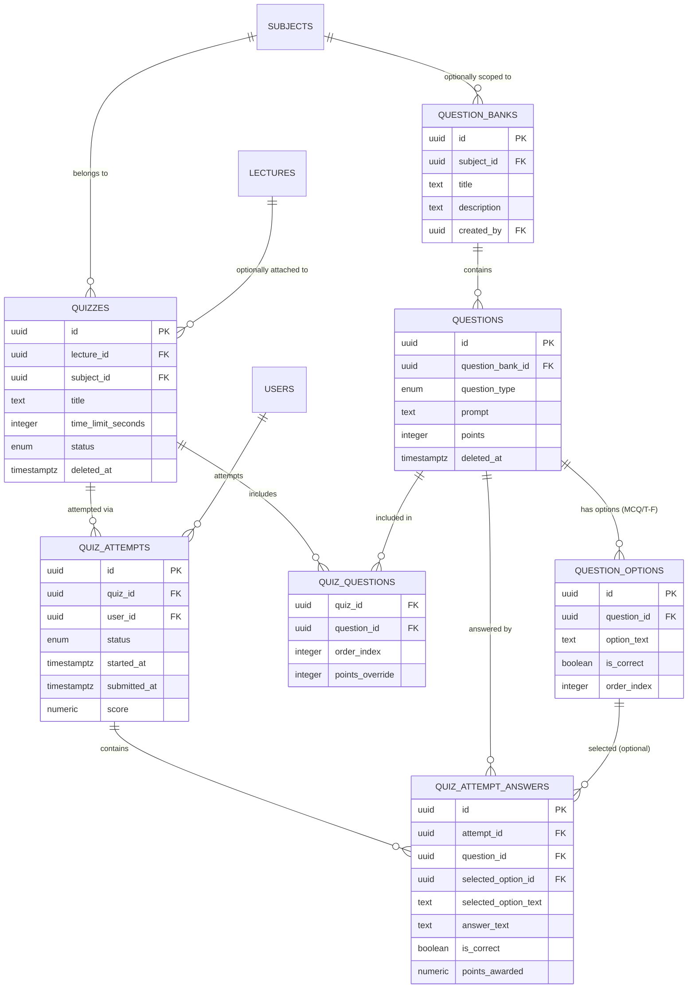
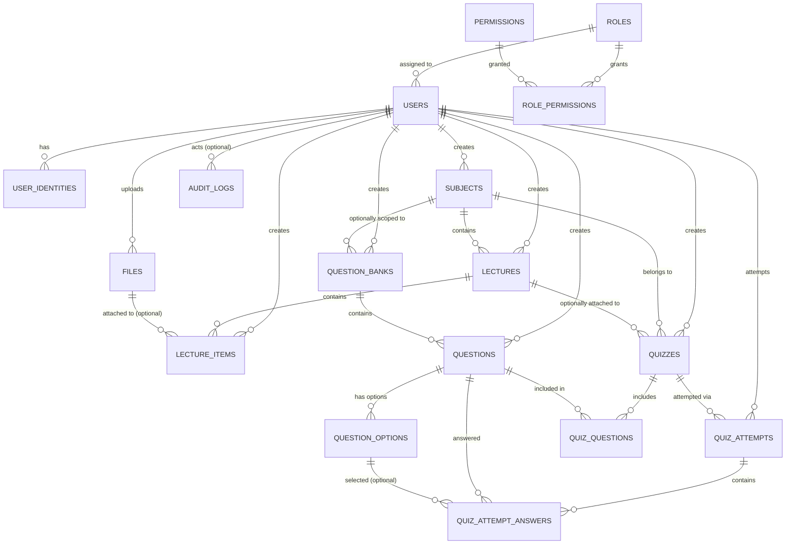

# Database ERD

Status: Phase 3 (Database Design) — diagrams only, companion to `DATABASE_DESIGN.md`. No schema has been created in any database.

## 1. User / Role Model

## 2. Educational Content Model

## 3. File Model

Note: `FILES` stores metadata only. The referenced binary content lives in private object storage outside the database, addressed by `storage_key` (see `ARCHITECTURE_DIAGRAM.md` §9 for the database/storage relationship diagram).

## 4. Assessment / Quiz Model

## 5. Complete Relationship Diagram

